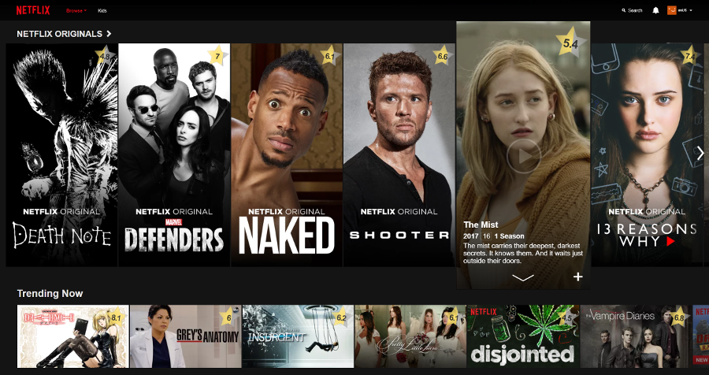
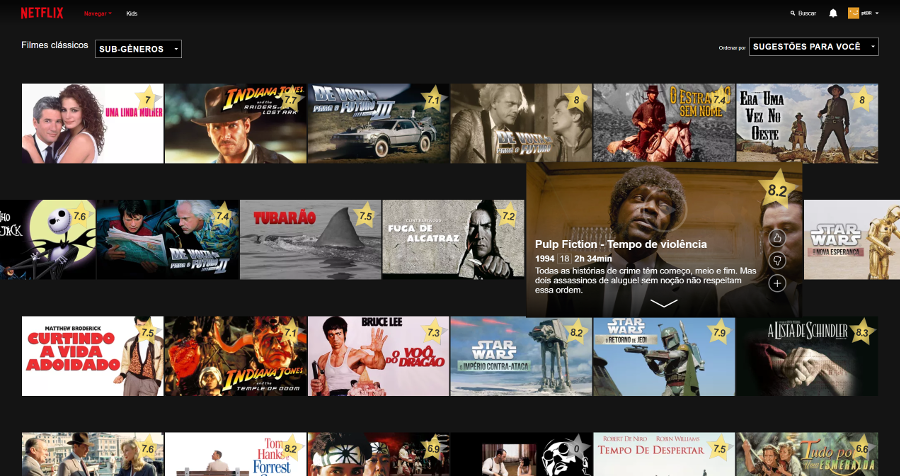

# Netfix (chrome extension)

A chrome extension to add TMDB ratings to Netflix interface, because why not.

This was inspired by a crappy *Match* system and lots of broken extensions in the store.

## Add to Chrome

Install from the [Chrome Web Store](https://chrome.google.com/webstore/detail/netfix/bdihekkpnckbmgafgoedabbebpafgfci/) or add it directly using the repo:

* clone it: `git clone https://github.com/bolaum/netfix`
* open chrome
* navigate to `chrome://extensions/`
* check *"Developer mode"*
* click *"Load unpacked extension..."*
* point to root of the cloned repo

The `build.py` script removes some development files (such as `hot-reload.js`) from the manifest and generates a clean zip in the `dist/` directory. There's no need to run, just follow the above instructions.

## Screenshots

Works in enUS

and ptBR

## Bugs and issues

This is currently experimental e needs testing. Please feel free to make a PR or report any issues.

## TODO

TBD

## Dependencies and Attributions

Libraries:

* JQuery (https://jquery.com/)
* jquery-observe (https://github.com/kapetan/jquery-observe)
* jquery-visible (https://github.com/customd/jquery-visible)
* underscore (http://underscorejs.org/)
* underscore rate_limit (https://gist.github.com/mattheworiordan/1084831)
* crx-hotreload (https://github.com/xpl/crx-hotreload)

Ratings provider:

https://www.themoviedb.org/

## Disclaimer

**Netfix Extension is not affiliated with Netflix.** Netflix product names are trademarks or registered trademarks of Netflix. This is an open project done with love, just for fun and no profit, but donations are most welcome!

**BTC:** 17YfYc5DCKQZBao1Au1HXBuEjtSaxN8xgM  
**ETH:** 0x00061d7b58026676BA1582E8e738088995AfCAEC
